# Table of Content

- [Table of Content](#table-of-content)
- [Tools Versions](#tools-versions)
- [Install Docker](#install-docker)
- [Run Jenkins from Docker container](#run-jenkins-from-docker-container)
- [Create First Job](#create-first-job)
- [Create Different jobs](#create-different-jobs)
  - [1. Display build number and URL](#1-display-build-number-and-url)
  - [2. Create job that runs Python code](#2-create-job-that-runs-python-code)


# Tools Versions

- OS: macOS Ventura 13.1
- Docker: 20.10.21
- Jenkins: 2.375.1
- Blueocean: 1.26.0
- Visual Studio Code: 1.74.2

# Install Docker

1. Install Docker from [here](https://www.docker.com)

# Run Jenkins from Docker container

1. **CREATE** a dedicated **NETWORK** called *jenkins*

```
docker network create jenkins
```

2. (optional) You can check the available networks by running the following command

```
docker network ls 
```

3. **CREATE** a **DOCKERFILE** with the following content

```
FROM jenkins/jenkins:2.375.1
USER root
RUN apt-get update && apt-get install -y lsb-release
RUN curl -fsSLo /usr/share/keyrings/docker-archive-keyring.asc \
  https://download.docker.com/linux/debian/gpg
RUN echo "deb [arch=$(dpkg --print-architecture) \
  signed-by=/usr/share/keyrings/docker-archive-keyring.asc] \
  https://download.docker.com/linux/debian \
  $(lsb_release -cs) stable" > /etc/apt/sources.list.d/docker.list
RUN apt-get update && apt-get install -y docker-ce-cli
USER jenkins
RUN jenkins-plugin-cli --plugins "blueocean:1.26.0 docker-workflow:563.vd5d2e5c4007f"
```

2. **CREATE** an **IMAGE** from the above Dockerfile by running the following command in the directory where the Dockerfile is

```
docker build -t jenkins-blueocean-image .
```
The *jenkins-blueocean-image* is the name of the image which can be changed to whatever you want.

3. (optional) To check docker images that you have just enter the following command. You will see there the image created above with the coressponding name and ID

```
docker images
```

4. **RUN** the image as a **CONTAINER** by using the following command

```
docker run --name jenkins-blueocean-container --restart=on-failure --detach \
  --network jenkins --env DOCKER_HOST=tcp://docker:2376 \
  --env DOCKER_CERT_PATH=/certs/client --env DOCKER_TLS_VERIFY=1 \
  --publish 8080:8080 --publish 50000:50000 \
  --volume jenkins-data:/var/jenkins_home \
  --volume jenkins-docker-certs:/certs/client:ro \
  jenkins-blueocean-image
```

5. (optional) You can check if the container is running ok by using the command. There you should see the container ID and the image

```
docker ps
```

6. Now go to this [website](http://localhost:8080)


7. You need to enter a password. To get the password you need to enter the following command where *CONTAINER_ID* is the ID of the jenkins container.

```
sudo docker exec CONTAINER_ID cat /var/jenkins_home/secrets/initialAdminPassword
```
   
8. After entering the password you will get the following page. 

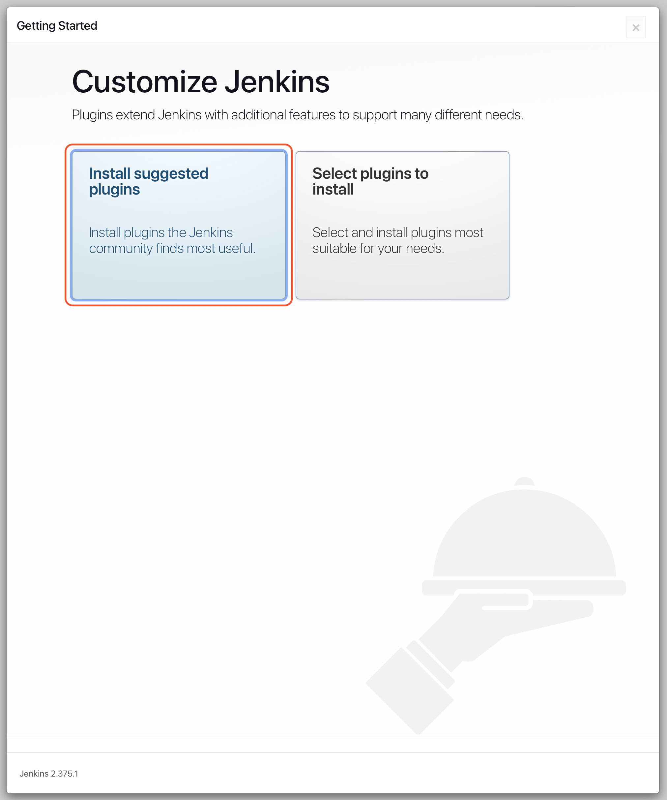

9. Click **Install suggested plugins** and wait.

10. Now you have to create a new **Admin User**. Just fill the fields up with your data and click **Save and Continue**

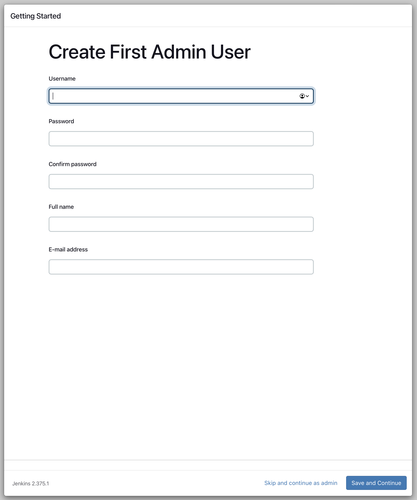

11. After creating the user you will get to the next page. Click **Save and Finish**

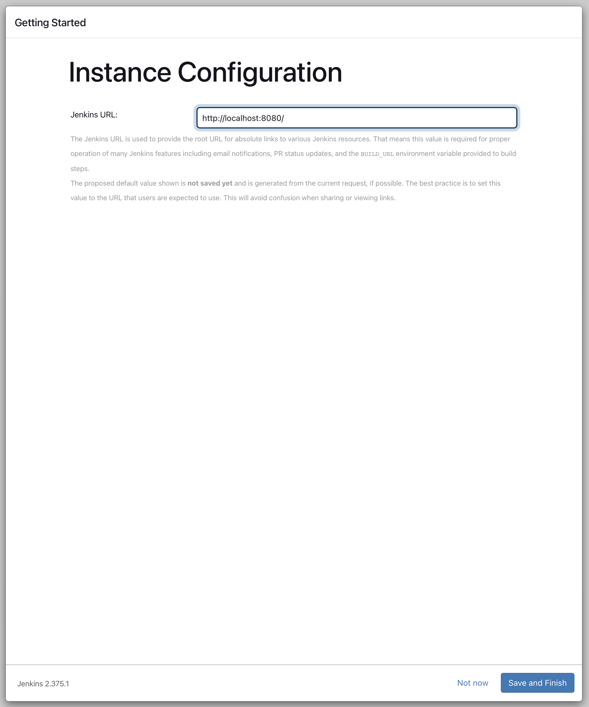

12. You finished to setup Jenkins. Click **Start using Jenkins**

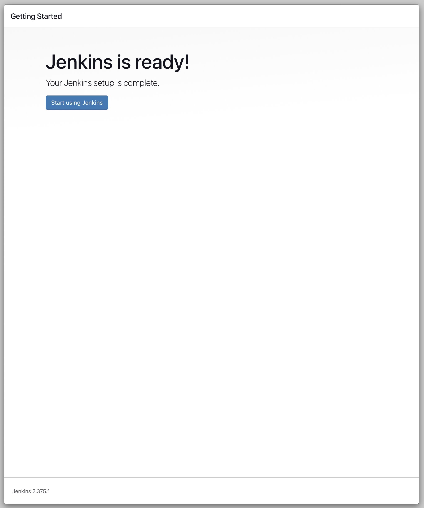

13. You got to the Jenkins Dashboard.

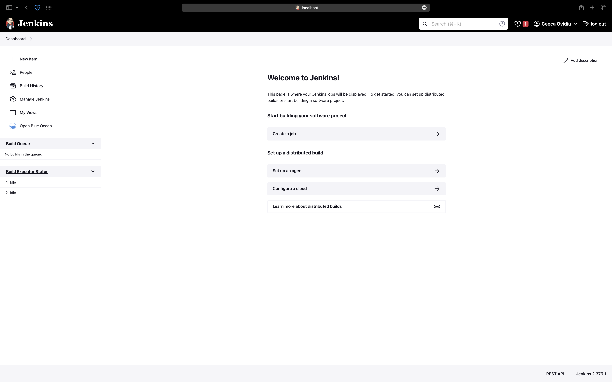

# Create First Job

1. Click on **New Item** from the left side of the page

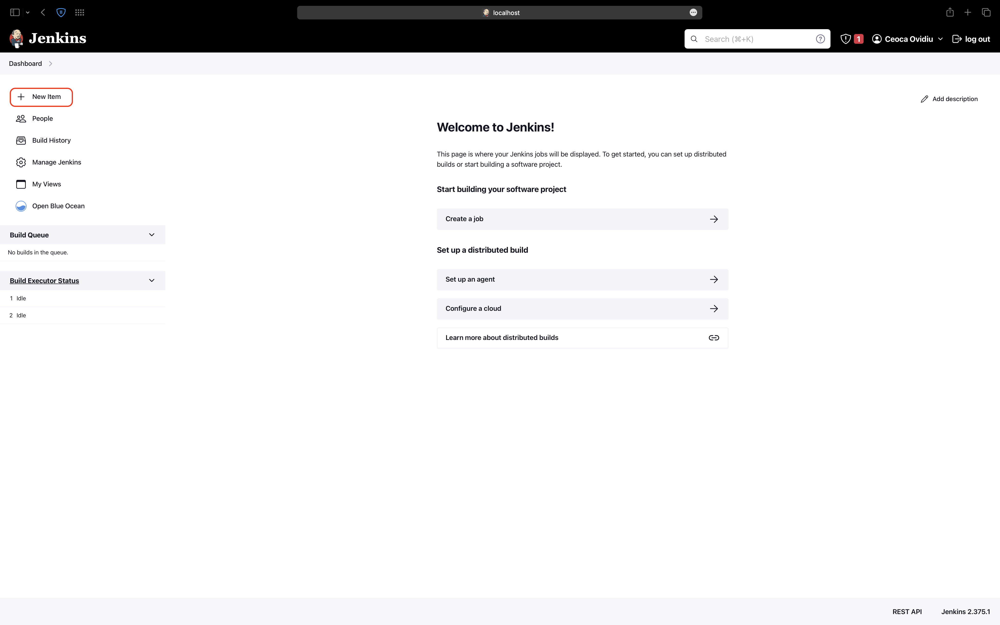

2. Give the project a name and select **Freestyle project** and click ok.

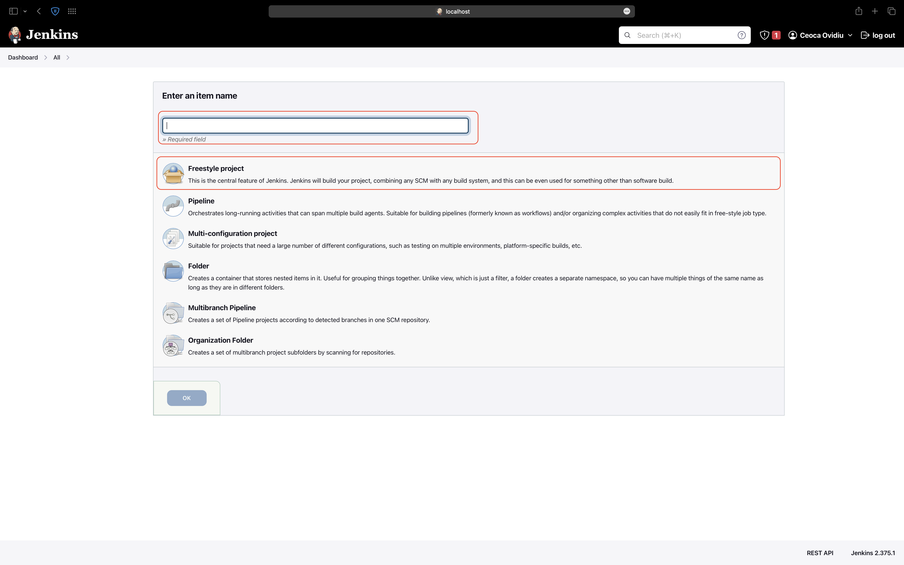

3. Here you can change what the job should do. As a first job, I changed the **Build** steps and I selected **Execute Shell**. There I put the following command

```
echo "Hello Jenkins"
```
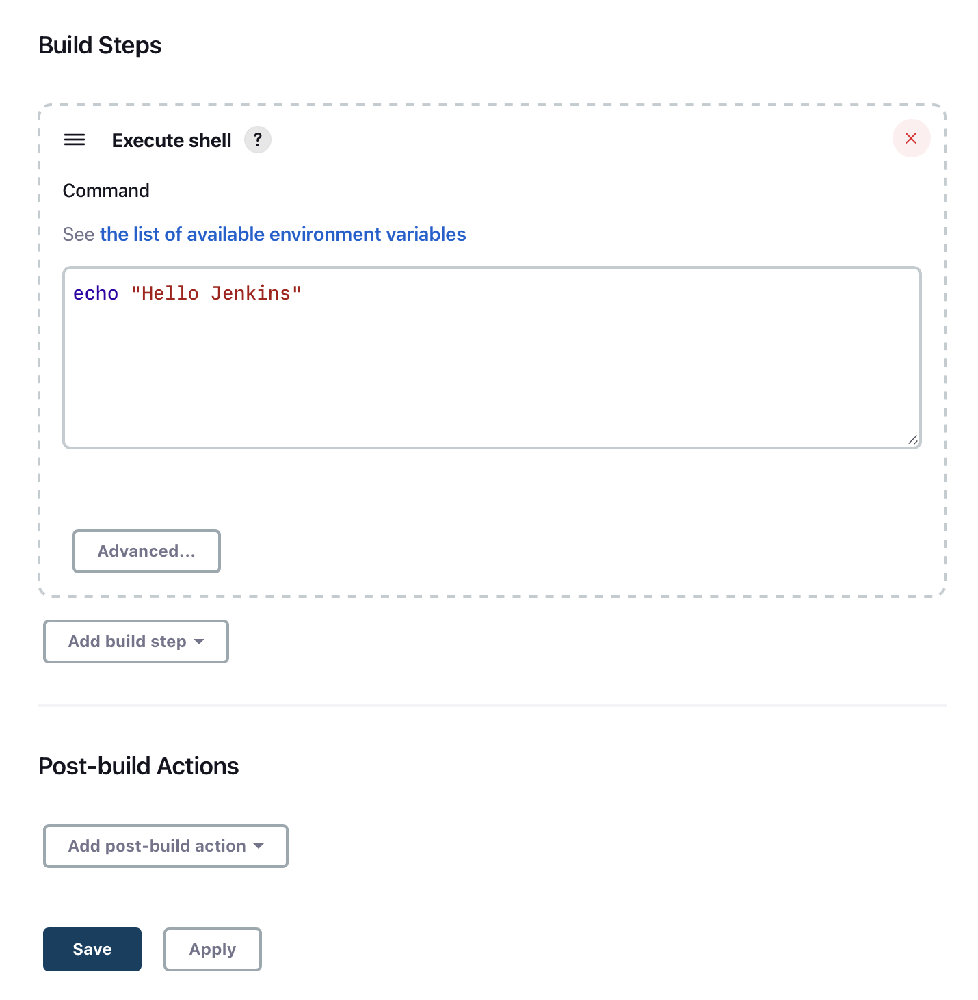

4. After saving the changes, on the left side you will see **Build Now** which will build the job. After building it, on the bottom left part of the screen you will see whether the job was build succsessfully.

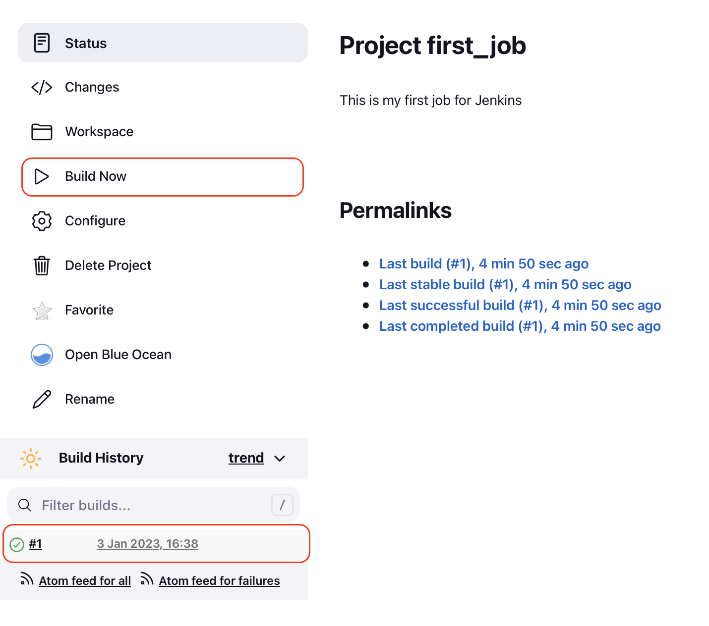

5. By clicking on the *Green checkmark* next to the number of build, it will open the build and see the output *Hello Jenkins*
   
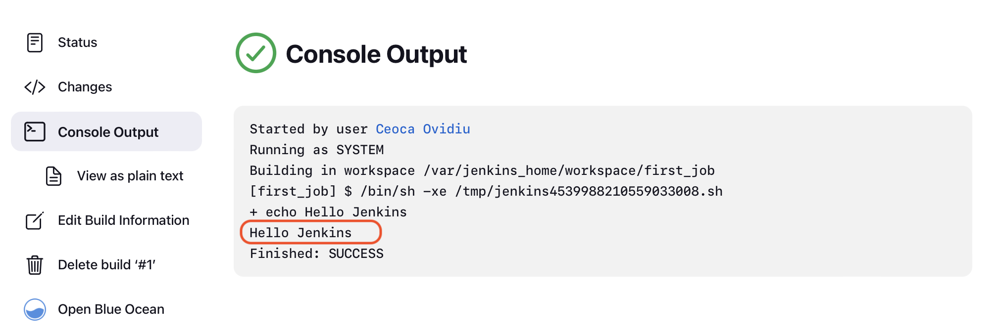

All resources are taken from [here](https://www.jenkins.io/doc/book/installing/docker/)

# Create Different jobs

## 1. Display build number and URL

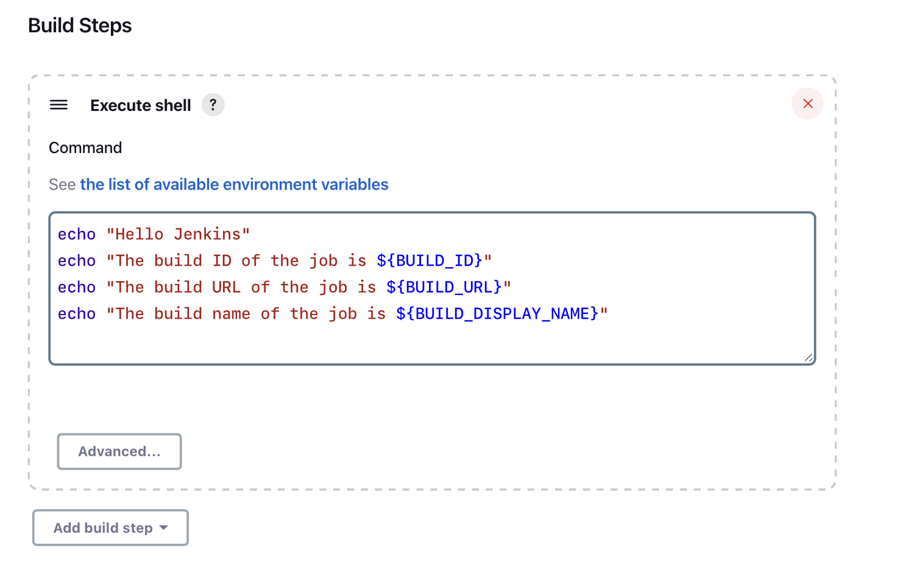
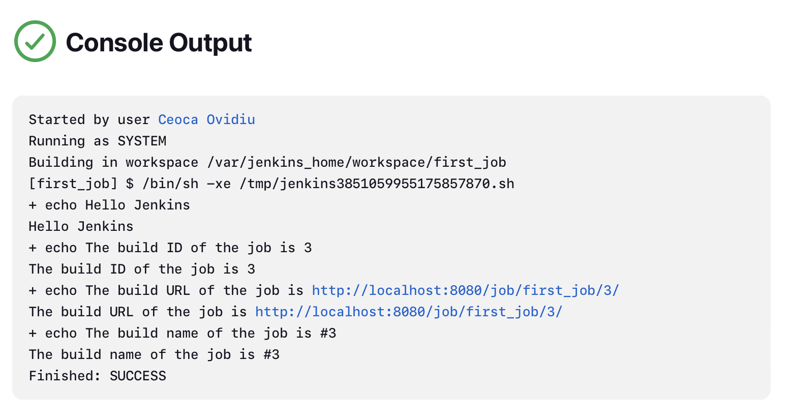
```
echo "Hello Jenkins"
echo "The build ID of the job is ${BUILD_ID}"
echo "The build URL of the job is ${BUILD_URL}"
echo "The build name of the job is ${BUILD_DISPLAY_NAME}"
```

## 2. Create job that runs Python code

This repo contains a file called **python_job.py**.

1. Create a new *Freestyle project* as above

2. Add the repository [link](https://github.com/ceoca-ovidiu/jenkins.git) to the Source Code Management section

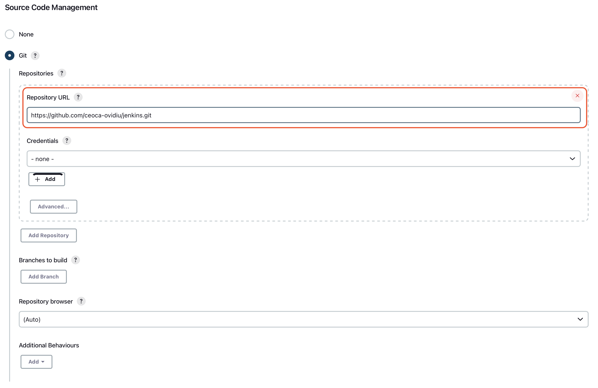

3. In the execute shell section add the following line of code

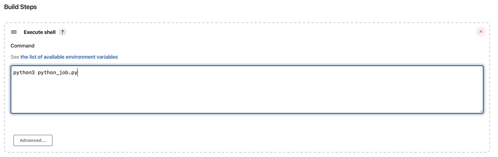

```
python3 python_job.py
```
